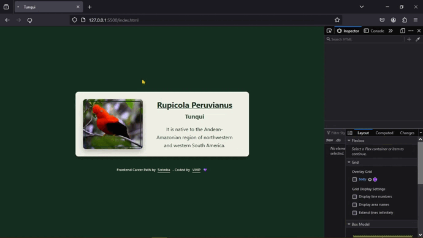
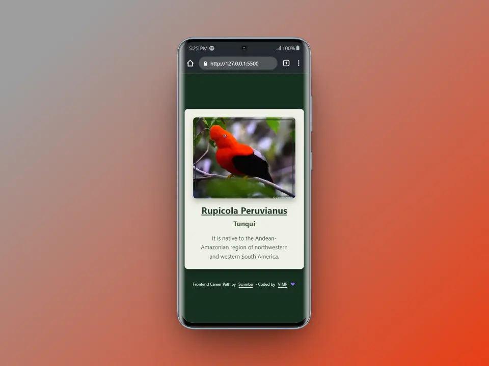
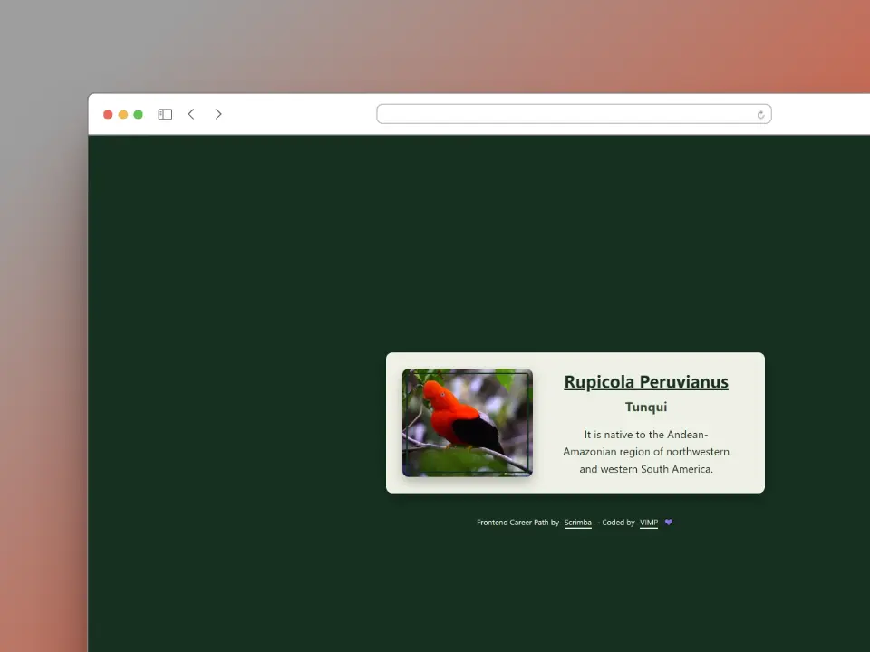

# Business Card

This is a solution from one of the projects that is part of the [Frontend Career Path](https://scrimba.com/learn/frontend) - Module 2 by [Scrimba](https://scrimba.com/).

### Table of contents

+ [The Challenge](#the-challenge)
+ [Screenshots](#screenshots)
+ [Links](#links)
+ [Built with](#built-with)
+ [Useful Resources](#useful-resources)
+ [Author](#author)

## The Challenge

📌 Build out the project on the design provided, modifying the data at our discretion.

## Screenshots

### 📱 Mobile

### 💻 Desktop

## Links

[Live](https://mendez-v.github.io/business-card/) 👀

[Scrim](https://scrimba.com/scrim/cbGdgwf4) 👀

[Frontend Career Path](https://github.com/mendez-v/frontend-career-path) 👀

## Built with

🎯 Semantic HTML markup

🎯 CSS custom properties

🎯 Flexbox

🎯 CSS Grid

🎯 Mobile-first workflow

## Useful Resources

🖼 Favicon - <a href="https://iconscout.com/icons/peru" class="text-underline font-size-sm" target="_blank">Peru</a> by <a href="https://iconscout.com/contributors/iconscout" class="text-underline font-size-sm" target="_blank">IconScout Store</a>

## Author

✨ Frontend Mentor - [@mendez-v](https://www.frontendmentor.io/profile/mendez-v)